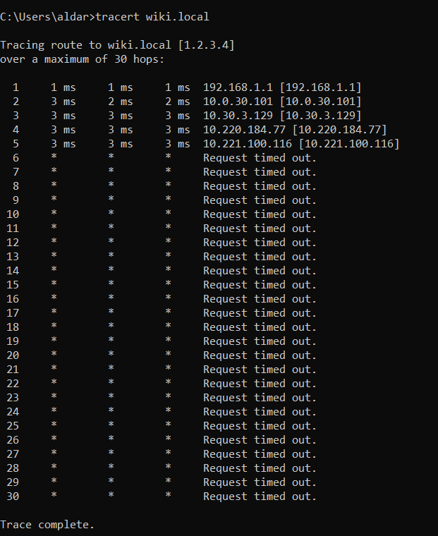
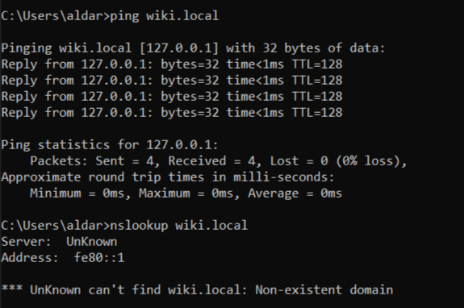

Laborator: "Hostname-ul Stricat"

Pregătire: 
Am deschis Notepad ca 'Run as administator' dupa care am navigat pana la C:\Windows\System32\drivers\etc\hosts si am editat fisierul (am adaugat 1.2.3.4    wiki.local)

## Sarcina 1 — Confirmă problema
Command output:

La ce adresă IP se rezolvă? Este accesibil? Care este eroarea?
- wiki.local se rezolva la IP-ul 1.2.3.4 si nu e accesibil. Primim eroarea: "Request timed out."

## Sarcina 2 — Verifică rezoluția DNS
Command output:

De unde vine răspunsul — de la serverul tău DNS sau dintr-o suprascriere locală?
- raspunsul vine de la serverul meu DNS, care nu gaseste domeniul wiki.local, comanda nslookup nu foloseste fisierul hosts

## Sarcina 3 — Urmărește traseul
Command output:

Câte hopuri până se întrerupe? Unde se oprește?
- 5 hopuri pana la intrerupere. Dupa hopul 5 (la 10.221.100.116) traseul se opreste si apare doar "Request timed out."

## Sarcina 4 — Rezolvă problema
Command output:

Ce s-a schimbat? Este accesibil acum? De ce?
- domeniul wiki.local se rezolva la adresa 127.0.0.1 (s-a schimbat adresa in 127.0.0.1 in loc de 1.2.3.4)
- este accesibil si raspunde corect deoarece cererea e directionata catre localhost astfel:
  
  Pinging wiki.local [127.0.0.1]
  Reply from 127.0.0.1

