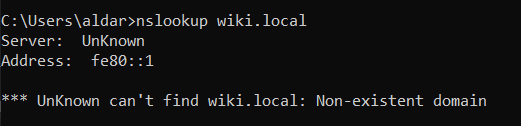

Laborator: "Hostname-ul Stricat"

Pregătire: 
Am deschis Notepad ca 'Run as administator' dupa care am navigat pana la C:\Windows\System32\drivers\etc\hosts si am editat fisierul (am adaugat 1.2.3.4    wiki.local)

## Sarcina 1 — Confirmă problema
Command output:

La ce adresă IP se rezolvă? Este accesibil? Care este eroarea?
- wiki.local se rezolva la IP-ul 1.2.3.4 si nu e accesibil. Primim eroarea: "Request timed out."

## Sarcina 2 — Verifică rezoluția DNS
Command output:

De unde vine răspunsul — de la serverul tău DNS sau dintr-o suprascriere locală?
- raspunsul vine de la serverul meu DNS, care nu gaseste domeniul wiki.local, comanda nslookup nu foloseste fisierul hosts
