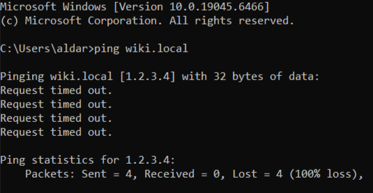

Laborator: "Hostname-ul Stricat"

Pregătire: 
Am deschis Notepad ca 'Run as administator' dupa care am navigat pana la C:\Windows\System32\drivers\etc\hosts si am editat fisierul (1.2.3.4    wiki.local)

Sarcina 1 — Confirmă problema

